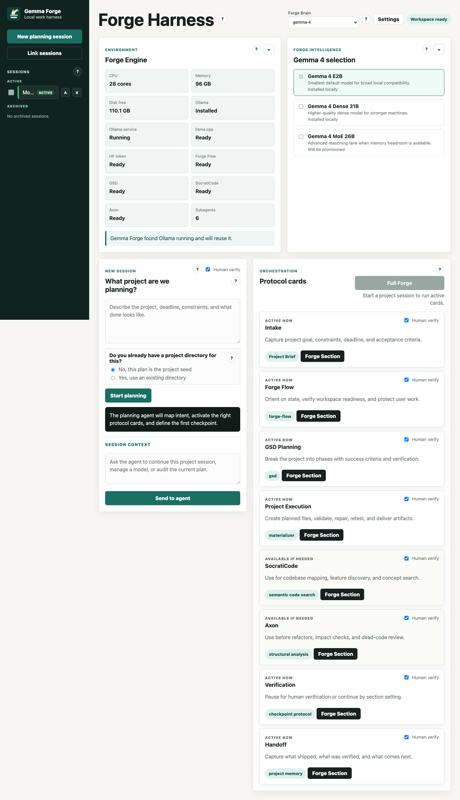

# Gemma Forge

<p align="center">
  
</p>

<p align="center">
  <strong>Local AI without the setup wall.</strong><br>
  A local Gemma 4 work harness for planning, execution, verification, and handoff.
</p>

<p align="center">
  <a href="https://github.com/TheRefreshCNFT/gemma-forge">Repository</a> |
  <a href="docs/submission-media">Demo Media</a> |
  <a href="CONTEST_READINESS.md">Contest Readiness</a> |
  <a href="CONTRIBUTING.md">Contributing</a>
</p>



## Why Gemma Forge Exists

Everyone should be able to use local AI. Gemma Forge opens that door by turning Gemma 4 into a guided local workbench instead of leaving users to learn model setup, terminal commands, Ollama internals, prompt formats, and agent protocols before they can get anything done.

Most people do not need to manage elaborate memory systems. They need work completed. Most teams do not need extra ceremony either. They need planning, execution, testing, evaluation, and delivery. Gemma Forge gives the local model a clear direction, adds the skills a task needs, and keeps the work scoped, observable, and verifiable.

Gemma Forge comes pre-fueled and ready for action with bundled protocol skills. Need more fire? Drop in another skill. Do not know how to build one yet? Start a Gemma Forge maintenance project and the harness can help create, stage, and verify a skill through its controlled maintenance flow.

## What It Is

Gemma Forge is a local Gemma 4 work harness built for the [Gemma 4 Challenge: Build with Gemma 4](https://dev.to/challenges/google-gemma-2026-05-06). It is designed for curious users, builders, and small teams who want local AI to help with real project work while keeping model execution, project state, and generated artifacts on their own machine.

The harness:

- Scans local readiness: CPU, memory, disk, Ollama, installed models, tool state, and bundled skills.
- Recommends a balanced Gemma 4 default model: `gemma-4-e4b-it`, the E4B / 4B-class lane chosen for extra reasoning headroom while staying practical for local use.
- Lets users switch to any installed and supported local model from the Forge Brain selector.
- Keeps each project in its own scoped workspace instead of one endless global chat.
- Runs work through protocol cards for context, planning, execution, code intelligence, verification, and handoff.
- Stages Forge skills into each project workspace so the local model can use the right instructions without depending on private absolute paths.
- Records model route evidence so users can verify that local Gemma is doing the work.
- Keeps generated project state out of the repository by default.

## Quick Start

### 1. Clone the repository

```bash
git clone https://github.com/TheRefreshCNFT/gemma-forge.git
cd gemma-forge
```

### 2. Create a Python environment

```bash
python3 -m venv .venv
source .venv/bin/activate
pip install -e .
```

### 3. Launch Gemma Forge

```bash
gemma-forge
```

Open:

```text
http://127.0.0.1:5005/
```

### macOS launcher

On macOS, you can use the bundled launcher instead:

```bash
./launch_forge.command
```

The launcher starts the harness and runs first-use provisioning checks for the local toolchain, bundled skills, SocratiCode, Axon, and Ollama-backed model readiness where available.

## Prerequisites

Gemma Forge is local-first. A typical setup should have:

- Python 3.10 or newer.
- Git.
- Ollama installed and running for local model calls.
- Node.js 18 or newer for JavaScript validation checks.
- A local Gemma model available through Ollama, or a model provisioned through the Forge settings UI.

The harness stores its own runtime state under `~/.gforge` and leaves Ollama in its normal `~/.ollama` home.

## First Run

When the app opens, Gemma Forge shows a workspace scan and readiness view:

- Forge Engine reports local hardware, Ollama state, tool readiness, and support capacity.
- Forge Intelligence shows supported Gemma lanes and whether they are installed or runnable.
- Forge Brain selects the active local model used by planning, execution, verification, and project chat.
- Settings can import installed Ollama models, search Hugging Face, provision supported GGUF models, show model-route proof, and open meaningful harness errors.

The first useful question is simple:

```text
What project are we planning?
```

Describe what you want built, researched, fixed, planned, or verified. Gemma Forge will turn that into a project-scoped workflow.

## How The Workflow Works

Gemma Forge uses protocol cards instead of a loose chat loop.

| Card | Purpose |
| --- | --- |
| Project Context | Converts the user request into a strict deliverable contract. |
| Forge Flow | Orients on project state and protects existing work. |
| GSD Planning | Breaks work into phases, acceptance criteria, and verification gates. |
| Project Execution | Writes model-authored files, runs allowed workspace commands, validates, repairs, and records artifacts. |
| SocratiCode | Provides semantic codebase discovery when existing code needs exploration. |
| Axon | Provides structural graph and impact analysis for codebase work. |
| Verification | Checks actual artifacts and deterministic validation evidence. |
| Handoff | Captures what happened, what was verified, risks, and next steps. |

Use **Full Forge** to run all active cards in order. Use **Forge Section** to run one card. Turn **Human Verify** on when you want checkpoints, or off when you want the harness to keep moving.

## Skills

Gemma Forge ships with bundled skills so a fresh clone can do useful work without requiring users to assemble an agent toolkit first.

Included skill families:

- `webot-flow` for state, backup, and verification discipline.
- `gsd` for project planning and phase execution.
- `code-writer` for runnable source-code deliverables.
- `scrapling-official` for web scraping, browsing, and extraction.
- `ui-ux-pro-max` for interface quality, layout, states, accessibility, and polish.
- `socraticode` for semantic codebase search and project discovery.
- `axon` for structural code graph and impact analysis.
- `logo-generator` for SVG logo and brand-mark work.
- `pdf` for PDF, form, and OCR-oriented tasks.
- `mcp-builder` for local MCP server and tool-schema work.

Skills are copied into each project workspace under `.gforge/skills` and injected only when relevant. This keeps projects portable and prevents the model from relying on private host paths.

## Maintenance Mode

Gemma Forge can help maintain itself. If you ask to change the harness, add or update a model, create a skill, adjust routing, repair readiness, or update installer behavior, the harness treats that as a Gemma Forge maintenance project.

Maintenance mode is intentionally controlled:

- The harness snapshots exact allowlisted repo or runtime targets into the project workspace.
- The model writes proposed changes into workspace artifacts.
- Outside-workspace changes must go through `artifacts/maintenance-actions.json`.
- Only validated `copy_file`, `write_file`, or `copy_tree` actions can be applied to allowlisted targets.
- Ollama commands are limited to explicit model-maintenance requests.

That gives the project a practical extension path without turning local AI into unrestricted host access.

## Local State And Privacy

Gemma Forge keeps runtime data local:

```text
~/.gforge/harness/
```

Ollama keeps models in its normal location:

```text
~/.ollama/
```

The repository is intentionally kept clean. These stay out of Git:

- Project records and generated workspaces.
- Local model registries and session data.
- `.gforge/`, `.axon/`, `.venv/`, caches, logs, and raw recordings.
- Model weights such as `.gguf` and `.safetensors`.
- Machine-specific files such as `.DS_Store` and AppleDouble metadata.

## Authenticity And Safety

Gemma Forge has one load-bearing rule: do not fake the result.

A valid run means the selected local Gemma model actually completes the requested task through the harness workflow. Scripts, validators, screenshots, and deterministic checks may verify or package the result, but they must not replace the model doing the work.

Safety boundaries include:

- Verification is read-only against deliverables.
- Workspace commands are bounded and sandboxed.
- Package installs are project-local.
- Deploy, publish, push, global installs, path escapes, shell pipes, and multiline shell are blocked in model-authored command paths.
- GitHub authentication can be used for clone/reference access, but tokens are not printed.
- Archived projects are read-only at the API boundary.

## Demo And Submission Materials

Public demo assets live in:

```text
docs/submission-media/
```

Useful entry points:

- [Demo recording guide](docs/submission-media/demo-recording-guide.md)
- [Screenshots](docs/submission-media/screenshots)
- [Processed demo clips](docs/submission-media/processed)
- [Contest readiness notes](CONTEST_READINESS.md)
- [DEV submission draft](SUBMISSION_DRAFT.md)

## Development Checks

Run the main static and unit checks:

```bash
npm run check
python -m unittest tests.model_route_test
python -m unittest tests.skill_routing_test
python -m unittest tests.maintenance_access_test
```

Clean-install verification for a fresh VM or fresh user account:

```bash
./tools/verify_clean_install.sh
```

The macOS VM orchestration helper is:

```bash
./tools/run_clean_install_test.sh
```

## Troubleshooting

### Ollama is down

Start Ollama and refresh the app:

```bash
ollama serve
```

### No Gemma model is available

Open Settings in Gemma Forge. You can import installed Ollama models, search Hugging Face, or provision a supported model into Ollama from the app.

### Port 5005 is already in use

Use the service helper:

```bash
npm run harness:status
npm run harness:restart
```

### The app launches with degraded tools

Gemma Forge can still run basic project flows when optional tools are unavailable, but SocratiCode, Axon, browser capture, and advanced validation depend on their local runtimes being ready. The launcher and Settings panel report this state plainly.

## Contributing

Gemma Forge is open source, but direct writes to `main` are maintainer-only. Public contributions should come through forks and pull requests for review.

Before opening a PR:

- Keep runtime data, generated sessions, local models, tokens, logs, and caches out of Git.
- Run `npm run check`.
- Explain how the change preserves the authenticity rule.
- Include verification evidence for user-facing behavior.

See [CONTRIBUTING.md](CONTRIBUTING.md) for the project contribution policy.

## License

MIT. See [LICENSE](LICENSE).
